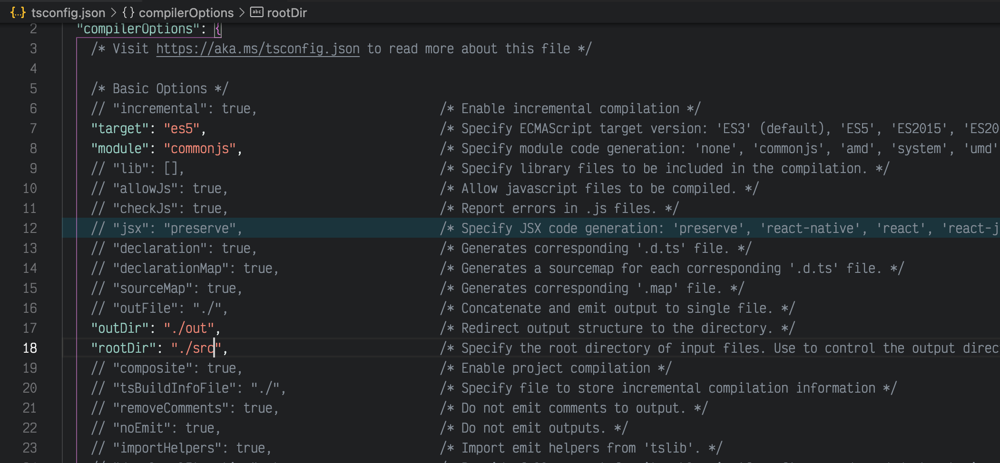

# Installation

Initialise a node project:

```bash
npm init -y
```

Install dependencies:

```bash
npm i -D typescript
```

Generates `tsconfig.json`

```bash
npx tsc --init
```

tsconfig settings:



[mongod](https://github.com/exqir/mongad#readme)

